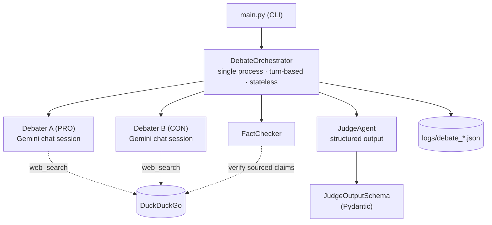
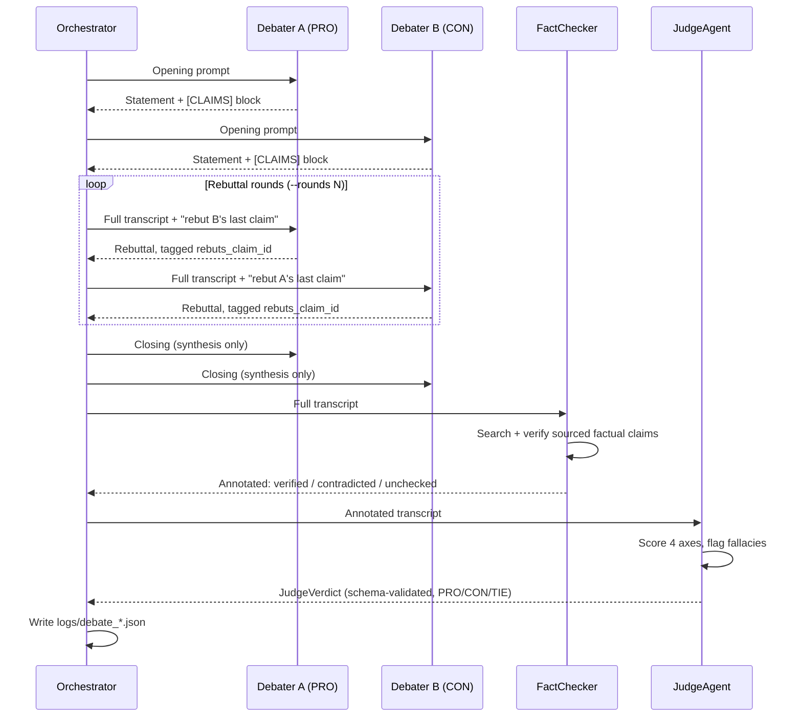
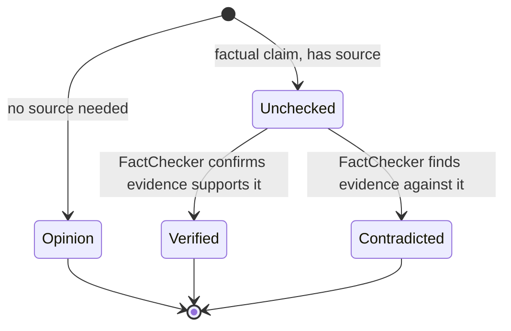

# AI Debate Arena

A domain-agnostic multi-agent debate platform. Two AI debaters argue opposing stances on any proposition, backed by live web search, an independent fact-checking pass, and a judge that scores the debate on four axes and returns a schema-validated verdict.

Built on the `google-genai` SDK (Gemini) with DuckDuckGo for live evidence retrieval.

## Architecture



## How a debate flows



Every turn appends a structured claim block — one line per claim: `<id>|<FACTUAL|OPINION>|"<text>"|<sources>|<rebuts_id>` — so later turns and the judge reference specific claim IDs (e.g. `CON-1-2`) instead of free text.

### Claim verification lifecycle



A contradicted or unverifiable citation scores *worse* on the judge's evidence axis than making no factual claim at all.

## Repository structure

```
agents/
  debater.py       DebaterAgent — Gemini chat session per debater + manual web_search tool loop
  fact_checker.py  FactChecker — verifies sourced factual claims before judging
  judge.py         JudgeAgent — structured-output verdict (Pydantic response_schema) + re-ask loop
  prompts.py       System prompts: debater search policy, claim format, judge rubric
tools/
  web_search.py    web_search() (DuckDuckGo, retry + no-fabrication policy) + Gemini FunctionDeclaration
utils/
  gemini.py        Shared google-genai client, send_with_retry (429/5xx backoff), function-calling loop
  logger.py        Logging setup + structured JSON log writer
config.py          Env-driven config (API key, model, rounds, log dir)
models.py          Claim / DebateTurn / DebateLog / JudgeVerdict dataclasses + Pydantic schema
orchestrator.py    DebateOrchestrator — the turn-based pipeline state machine
main.py            CLI entry point — runs the pipeline, prints summary, saves JSON log
tests/             Unit tests + gated live integration test
```

## Key design decisions

- **Single process, stateless, turn-based.** No MCP, no RAG, no agent-to-agent messaging — the orchestrator holds the full transcript and injects it into every prompt.
- **Full-transcript context.** Debaters see the entire debate so far, formatted with claim IDs, on every turn — no context loss across rounds.
- **Structured claims, tolerant parsing.** Claim blocks are parsed per line; malformed lines are skipped with a warning instead of failing the whole turn.
- **Search policy.** `web_search` is reserved for `FACTUAL` claims; if search is unavailable, the model is instructed to never fabricate a URL and fall back to reasoning instead.
- **Judge output is schema-enforced.** Gemini returns the verdict via `response_schema`; invalid JSON triggers a re-ask loop (up to 2 attempts), then a tolerant text fallback.
- **Resilience.** 429/5xx retries with backoff (`utils/gemini.py`); `web_search` returns a structured error object instead of raising once retries are exhausted.

## Installation

```bash
python -m venv venv
source venv/bin/activate      # Windows: venv\Scripts\activate
pip install -r requirements.txt
cp .env.example .env
```

Set in `.env`:
```
GOOGLE_API_KEY=your_gemini_api_key_here
GEMINI_MODEL=gemini-2.5-flash
```

| Variable | Default | Description |
|---|---|---|
| `GOOGLE_API_KEY` | *(required)* | Gemini API key from Google AI Studio |
| `GEMINI_MODEL` | `gemini-2.5-flash` | Model used by all agents |
| `DEFAULT_REBUTTAL_ROUNDS` | `2` | Rebuttal rounds when `--rounds` isn't passed |
| `LOG_DIR` | `logs` | Directory for structured JSON debate logs |

> The free Gemini tier limits requests per day per model (e.g. 20 req/day for `gemini-2.5-flash`). A full debate consumes several calls per side plus fact-checking and judging — budget accordingly.

## Usage

```bash
python main.py "Universal Basic Income should be implemented globally"
python main.py "The Great Wall of China is visible from low Earth orbit" --rounds 1
```

Prints a phase-by-phase transcript (speaker, phase, prose, structured claims), the judge's reasoning, flagged fallacies, per-axis scores, and the winner. A full structured log is saved to `logs/debate_<timestamp>.json`:

```json
{
  "topic": "...",
  "timestamp": "...",
  "model_used": "gemini-2.5-flash",
  "turns": [
    {
      "speaker": "Debater A (PRO)",
      "role": "PRO",
      "phase": "OPENING",
      "claims": [
        {
          "claim_id": "PRO-1-1",
          "is_factual": true,
          "sources": ["..."],
          "rebuts_claim_id": null,
          "verified": true,
          "verification_note": "YES: ..."
        }
      ],
      "raw_text": "..."
    }
  ],
  "verdict": {
    "winner": "PRO",
    "scores": { "logical_coherence": {"A": 8.5, "B": 8.0} },
    "reasoning": "...",
    "flagged_fallacies": [],
    "unverified_or_contradicted_claims": []
  }
}
```

## Testing

```bash
pytest                    # unit tests (live API tests deselected by default)
pytest -m integration     # live end-to-end debate (calls Gemini + DuckDuckGo)
```

`tests/test_pipeline_golden.py` runs the full orchestrator → fact-check → judge → log pipeline against real APIs and is gated behind the `integration` marker so unit runs stay fast and offline.

## Roadmap

- [ ] ELO ratings across debates to compare models/personas over time
- [ ] Blind judging (judge doesn't know which debater = which model)
- [ ] Multi-judge panel with score aggregation
- [ ] Live co-judge mode for real competitive debate rounds — transcribes a live round, fact-checks claims in real time, drafts a ballot for a human judge to review and submit (never auto-decides)
