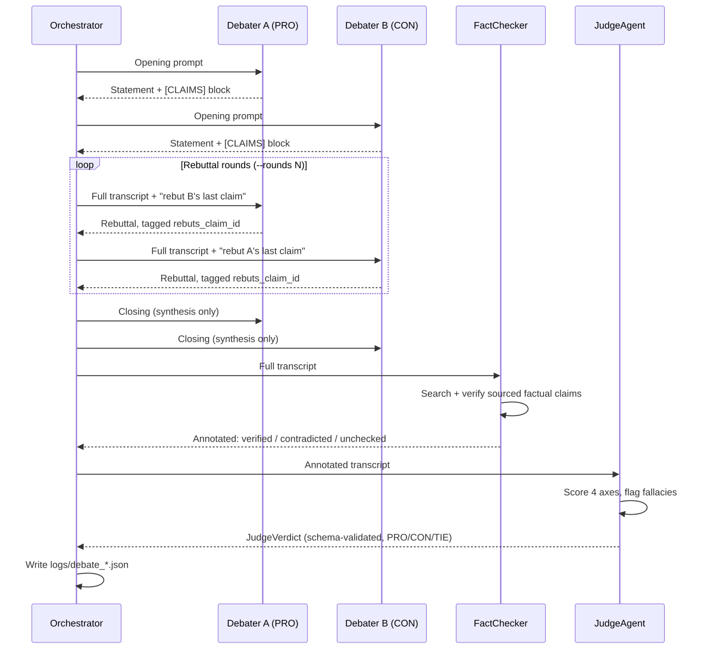

# AI Debate Arena

Two agents debate any proposition — PRO vs CON. A third agent independently fact-checks their claims with live web search, and a judge scores the round on four axes and names a winner. All in a single stateless Python pipeline. Works with **Gemini, Groq, or OpenRouter** (free keys supported). No agent framework, no orchestration server, no external services beyond the LLM API and DuckDuckGo.


## Quick start

```bash
python -m venv venv
source venv/bin/activate      # Windows: venv\Scripts\activate
pip install -r requirements.txt
cp .env.example .env          # then add GOOGLE_API_KEY
```

```bash
python main.py "Universal Basic Income should be implemented globally"
python main.py "Coffee is the second most traded commodity after oil" --rounds 1
```

The CLI prints the full phase-by-phase transcript (speaker, phase, prose, structured claims), the judge's reasoning, flagged fallacies, per-axis scores, and the winner. A structured JSON log of the entire debate is saved to `logs/debate_<timestamp>.json`.

## How a debate flows

Every turn appends a structured claim block — one line per claim: `<id>|<FACTUAL|OPINION>|"<text>"|<sources>|<rebuts_id>` — so later turns and the judge reference specific claim IDs (e.g. `CON-1-2`) instead of free text.



*Editable source: [`docs/diagrams/flow.mmd`](docs/diagrams/flow.mmd)*

### Claim verification lifecycle



*Editable source: [`docs/diagrams/claim_lifecycle.mmd`](docs/diagrams/claim_lifecycle.mmd)*

A contradicted or unverifiable citation scores *worse* on the judge's evidence axis than making no factual claim at all.

## Architecture



*Editable source: [`docs/diagrams/architecture.mmd`](docs/diagrams/architecture.mmd)*

```
agents/
  debater.py       DebaterAgent — Gemini chat session per debater + manual web_search tool loop
  fact_checker.py  FactChecker — verifies sourced factual claims before judging
  judge.py         JudgeAgent — structured-output verdict (Pydantic response_schema) + re-ask loop
  prompts.py       System prompts: debater search policy, claim format, judge rubric
tools/
  web_search.py    web_search() (DuckDuckGo, retry + no-fabrication policy) + Gemini FunctionDeclaration
utils/
  gemini.py        Shared google-genai client, send_with_retry (429/5xx backoff), function-calling loop
  logger.py        Logging setup + structured JSON log writer
config.py          Env-driven config (API key, model, rounds, log dir)
models.py          Claim / DebateTurn / DebateLog / JudgeVerdict dataclasses + Pydantic schema
orchestrator.py    DebateOrchestrator — the turn-based pipeline state machine
main.py            CLI entry point — runs the pipeline, prints summary, saves JSON log
tests/             Unit tests + gated live integration test
docs/
  diagrams/        Mermaid sources (.mmd) + rendered SVGs used in this README
```

## Configuration

Set `LLM_PROVIDER` to pick the backend. Gemini is the default; Groq and OpenRouter both accept **free** API keys.

| Variable | Default | Description |
|---|---|---|
| `LLM_PROVIDER` | `gemini` | Backend: `gemini`, `groq`, or `openrouter` |
| `GOOGLE_API_KEY` | *(required for gemini)* | Gemini API key from Google AI Studio |
| `GEMINI_MODEL` | `gemini-2.5-flash` | Gemini model |
| `GROQ_API_KEY` | *(required for groq)* | Free key from https://console.groq.com/keys |
| `GROQ_MODEL` | `llama-3.3-70b-versatile` | Groq model |
| `OPENROUTER_API_KEY` | *(required for openrouter)* | Free key from https://openrouter.ai/settings/keys |
| `OPENROUTER_MODEL` | `deepseek/deepseek-chat-v3-0324:free` | OpenRouter model (`:free` = no-cost) |
| `DEFAULT_REBUTTAL_ROUNDS` | `2` | Rebuttal rounds when `--rounds` isn't passed |
| `LOG_DIR` | `logs` | Directory for structured JSON debate logs |

To switch provider, set `LLM_PROVIDER` and the matching key/model in `.env` — for example:

```
LLM_PROVIDER=groq
GROQ_API_KEY=gsk_...
GROQ_MODEL=llama-3.3-70b-versatile
```

> Free tiers are rate-limited per day (e.g. Gemini ~20 req/day/model). A full debate consumes several calls per side plus fact-checking and judging — budget accordingly, or switch providers.

## Design decisions

- **Single process, stateless, turn-based.** No MCP, no RAG, no agent-to-agent messaging — the orchestrator holds the full transcript and injects it into every prompt.
- **Full-transcript context.** Debaters see the entire debate so far, formatted with claim IDs, on every turn — no context loss across rounds.
- **Structured claims, tolerant parsing.** Claim blocks are parsed per line; malformed lines are skipped with a warning instead of failing the whole turn.
- **Search policy.** `web_search` is reserved for `FACTUAL` claims; if search is unavailable, the model is instructed to never fabricate a URL and fall back to reasoning instead.
- **Judge output is schema-enforced.** Gemini returns the verdict via `response_schema`; invalid JSON triggers a re-ask loop (up to 2 attempts), then a tolerant text fallback.
- **Resilience.** 429/5xx retries with backoff (`utils/gemini.py`); `web_search` returns a structured error object instead of raising once retries are exhausted.

## Related work

This project builds on a real research lineage, not just an intuition:

- **AI Safety via Debate** (Irving, Christiano, Amodei — OpenAI, 2018): the foundational idea — two agents debate, a judge decides, and judging should be easier than directly answering a hard question. The conceptual root of the PRO/CON/Judge structure here.
- **Improving Factuality and Reasoning in Language Models through Multiagent Debate** (Du et al., MIT — 2023): shows that LLMs debating each other over multiple rounds measurably reduces hallucinations and improves factual accuracy — the direct precedent for this project's fact-checking layer.
- **Debating with more persuasive LLMs leads to more truthful answers** (Khan et al. — 2024): studies whether a judge can be misled by rhetoric over truth in an LLM debate — closely related to why this project scores a contradicted citation worse than no citation at all.
- **Debate helps supervise unreliable experts** (Michael, Bowman, et al. — 2023): studies whether a judge without full information can still reach correct verdicts by watching a debate — relevant to the judge's fact-checking role here.
- **ChatEval** (Chan et al., ICLR 2024): a multi-agent "referee team" for LLM evaluation; found that giving each judge a genuinely distinct role/persona (not identical prompts) was essential to performance — worth keeping in mind for this project's multi-judge panel.

Known open problems in this research area worth being aware of: the *obfuscated arguments problem* (a dishonest debater can construct a flawed argument whose flaw is hard to find), and *conformity effects* (weaker models tend to abandon correct positions and just agree with the majority rather than being genuinely persuaded).

## Testing

```bash
pytest                    # unit tests (live API tests deselected by default)
pytest -m integration     # live end-to-end debate (calls Gemini + DuckDuckGo)
```

`tests/test_pipeline_golden.py` runs the full orchestrator → fact-check → judge → log pipeline against real APIs and is gated behind the `integration` marker so unit runs stay fast and offline.

## Roadmap

- [ ] ELO ratings across debates to compare models/personas over time
- [ ] Blind judging (judge doesn't know which debater = which model)
- [x] Multi-judge panel with score aggregation
- [ ] Live co-judge mode for real competitive debate rounds — transcribes a live round, fact-checks claims in real time, drafts a ballot for a human judge to review and submit (never auto-decides)

## Why not LangGraph / AutoGen / CrewAI / MCP / RAG?

This project deliberately uses none of them.

- **No agent framework.** The pipeline is two actors (debaters) plus a verifier and a judge, orchestrated by a single loop that passes a full transcript. Adding LangGraph or AutoGen buys a graph DSL and a message bus this design doesn't need — and the pipeline state machine in `orchestrator.py` is ~150 lines you can read in one sitting.
- **No MCP.** The only tool is `web_search`; wiring a single function call into `google-genai`'s function-calling loop is simpler than running an MCP server.
- **No RAG / vector store.** Debaters search on demand, per claim, and the judge re-checks. There is no corpus to index — embedding it would add latency and a dependency without improving evidence quality.
- **No agent-to-agent messaging.** Debaters never talk to each other; they both see the full transcript every turn. The judge only reads. This keeps every model call reproducible and makes the debate log a single source of truth.

If you want dozens of autonomous agents negotiating over a message bus, this isn't the repo. If you want a readable, testable, ~150-line multi-agent debate you can fork in an afternoon, it is.

## Why not just use Claude/Gemini?

The debaters, fact-checker, and judge are all LLM calls — so the honest question is what this repo adds over a single chat prompt. Three things:

- **Reasoning pressure.** An agent that must defend a position and respond to rebuttals produces sharper, more self-critical arguments than one unopposed generation — the multiagent-debate-improves-factuality effect cited in [Related work](#related-work).
- **Independent verification.** A separate agent with live web search checks claims after they're made, and the judge scores a contradicted citation *worse* than no citation at all. A single model grading its own output can't do that without a second model.
- **A reproducible transcript.** Every round, claim, source, and score lands in a structured JSON log. You keep the reasoning and evidence, not just the final answer.
